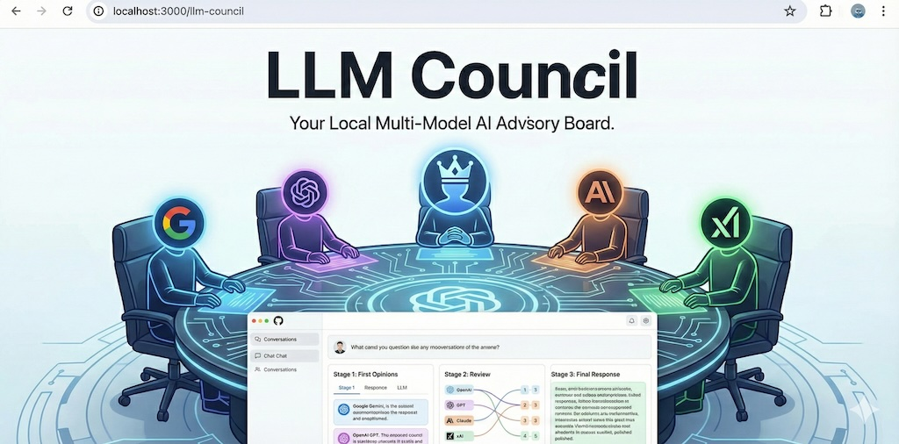

# LLM Council



> Based on [karpathy/llm-council](https://github.com/karpathy/llm-council). All
> credit for the idea and the original build goes to Andrej Karpathy. This fork
> adds live streaming, an always-on macOS setup, and a current model lineup.
> See [What's different here](#whats-different-here).

The idea of this repo is that instead of asking a question to your favorite LLM provider (e.g. OpenAI GPT 5.1, Google Gemini 3.0 Pro, Anthropic Claude Sonnet 4.5, xAI Grok 4, eg.c), you can group them into your "LLM Council". This repo is a simple, local web app that essentially looks like ChatGPT except it uses OpenRouter to send your query to multiple LLMs, it then asks them to review and rank each other's work, and finally a Chairman LLM produces the final response.

In a bit more detail, here is what happens when you submit a query:

1. **Stage 1: First opinions**. The user query is given to all LLMs individually, and the responses are collected. The individual responses are shown in a "tab view", so that the user can inspect them all one by one.
2. **Stage 2: Review**. Each individual LLM is given the responses of the other LLMs. Under the hood, the LLM identities are anonymized so that the LLM can't play favorites when judging their outputs. The LLM is asked to rank them in accuracy and insight.
3. **Stage 3: Final response**. The designated Chairman of the LLM Council takes all of the model's responses and compiles them into a single final answer that is presented to the user.

## Vibe Code Alert

This project was 99% vibe coded as a fun Saturday hack because I wanted to explore and evaluate a number of LLMs side by side in the process of [reading books together with LLMs](https://x.com/karpathy/status/1990577951671509438). It's nice and useful to see multiple responses side by side, and also the cross-opinions of all LLMs on each other's outputs. I'm not going to support it in any way, it's provided here as is for other people's inspiration and I don't intend to improve it. Code is ephemeral now and libraries are over, ask your LLM to change it in whatever way you like.

## What's different here

- **Streaming.** Answers appear word by word as each model writes them, instead
  of all at once at the end. Stage 1's tabs show up immediately, all council
  members stream in parallel, and the Chairman's answer streams in last. Models
  that expose their reasoning show a "thinking..." state before they start writing.
- **Current models.** The original lineup (GPT-5.1, Gemini 3 Pro preview,
  Claude Sonnet 4.5, Grok 4) is no longer on OpenRouter. See `backend/config.py`
  for what it uses now.
- **Always-on option.** A macOS login agent that serves the API and the built
  frontend from one port, so there is no terminal to keep open.
- **Small fixes.** Server-sent events are now parsed with a buffer (chunks that
  split mid-event used to be dropped), any localhost port is allowed by CORS,
  and one failing model no longer takes down the rest of the council.

## Setup

### 1. Install Dependencies

The project uses [uv](https://docs.astral.sh/uv/) for project management.

**Backend:**
```bash
uv sync
```

**Frontend:**
```bash
cd frontend
npm install
cd ..
```

### 2. Configure API Key

Copy `.env.example` to `.env` in the project root and fill in your key:

```bash
OPENROUTER_API_KEY=sk-or-v1-...
```

Get your API key at [openrouter.ai](https://openrouter.ai/). Make sure to purchase the credits you need, or sign up for automatic top up.

### 3. Configure Models (Optional)

Edit `backend/config.py` to customize the council:

```python
COUNCIL_MODELS = [
    "openai/gpt-5.1",
    "google/gemini-3-pro-preview",
    "anthropic/claude-sonnet-4.5",
    "x-ai/grok-4",
]

CHAIRMAN_MODEL = "google/gemini-3-pro-preview"
```

## Running the Application

**Option 1: Use the start script**
```bash
./start.sh
```

**Option 2: Run manually**

Terminal 1 (Backend):
```bash
uv run python -m backend.main
```

Terminal 2 (Frontend):
```bash
cd frontend
npm run dev
```

Then open http://localhost:5173 in your browser.

## Streaming

Answers appear word by word as each model writes them, rather than all at once
at the end. Stage 1's tabs show up immediately (one per council member), Stage 2
fills in as the models review each other, and the Chairman's final answer streams
in last. While a model is still thinking and hasn't written anything yet, you see
"thinking..." plus its reasoning, if the model exposes it.

The page follows the text down as it streams until you scroll up yourself.

## Always-on setup (macOS)

The server runs automatically at login and restarts itself if it crashes, so
there is no terminal to keep open. Open **http://localhost:8001** any time.

Keep the project outside `~/Documents`, `~/Desktop` and `~/Downloads`, for
example at `~/llm-council`. macOS blocks login-startup programs from reading
those folders, and the agent will die with `Operation not permitted` if you
don't. Symlink it back into your usual projects folder if you want it there.

The agent lives at `~/Library/LaunchAgents/com.aidenkaro.llmcouncil.plist`, and
points at `run-server.sh` in this repo.

In this mode one server does everything: the API *and* the built frontend, both
on port 8001. `./start.sh` is still there for development (Vite hot reload), but
it will refuse to run while the always-on server has the port.

Useful commands:

```bash
# stop it
launchctl bootout gui/$(id -u)/com.aidenkaro.llmcouncil

# start it again
launchctl bootstrap gui/$(id -u) ~/Library/LaunchAgents/com.aidenkaro.llmcouncil.plist

# see what it is doing
tail -f ~/Library/Logs/llm-council.log

# apply changes (config.py, or anything in frontend/src)
cd ~/llm-council/frontend && npm run build && cd .. && launchctl kickstart -k gui/$(id -u)/com.aidenkaro.llmcouncil
```

Remove it entirely by stopping it and deleting
`~/Library/LaunchAgents/com.aidenkaro.llmcouncil.plist`.

## Tech Stack

- **Backend:** FastAPI (Python 3.10+), async httpx, OpenRouter API
- **Frontend:** React + Vite, react-markdown for rendering
- **Storage:** JSON files in `data/conversations/`
- **Streaming:** OpenRouter SSE per model, re-broadcast to the browser as SSE
- **Package Management:** uv for Python, npm for JavaScript
