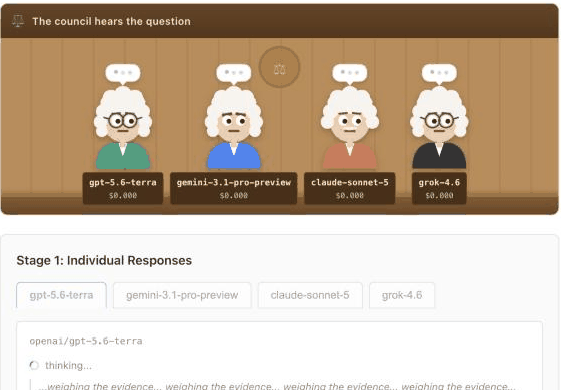

# LLM Council

Ask once. Four AI models answer, rank each other blind, and you get one short
verdict.

**[Open it →](https://aidenkaro10.github.io/llm-council/)** Bring your own
[OpenRouter key](https://openrouter.ai/settings/keys). Nothing to install.



> Based on [karpathy/llm-council](https://github.com/karpathy/llm-council).
> The idea and the original build are Andrej Karpathy's.

## How it works

1. Every judge answers your question.
2. Each judge ranks the others' answers with the names hidden, so nobody can
   play favourites.
3. A chairman writes one answer from all of it.

You see the verdict. Everything else, every judge's answer and every review,
is one click away under **How they got there**. The judge ranked best gets a
crown.

## Your key and your money

Your key stays in your browser and goes straight to openrouter.ai. There is no
server. A question with four flagship models costs about 7 cents; the app shows
an estimate before you send and the real cost after. Swap in cheaper judges in
Settings to spend less.

## Run it yourself

```bash
cd frontend
npm install
npm run dev
```

`npm test` runs the tests, offline and free. Pushing to `main` tests and deploys
to GitHub Pages. If you fork it, change `base` in `frontend/vite.config.js` to
your repo name.

## Notes

The mechs' head marks are simple drawings for telling models apart, not the
companies' logos, and none of those companies endorse this.

Karpathy's repo has no licence, so neither does this one. Treat it the way he
framed his: there for inspiration. For anything that came from him, assume you
need his permission.
